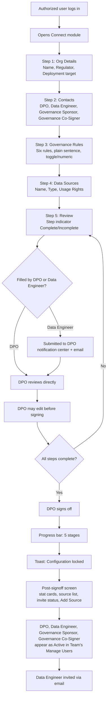
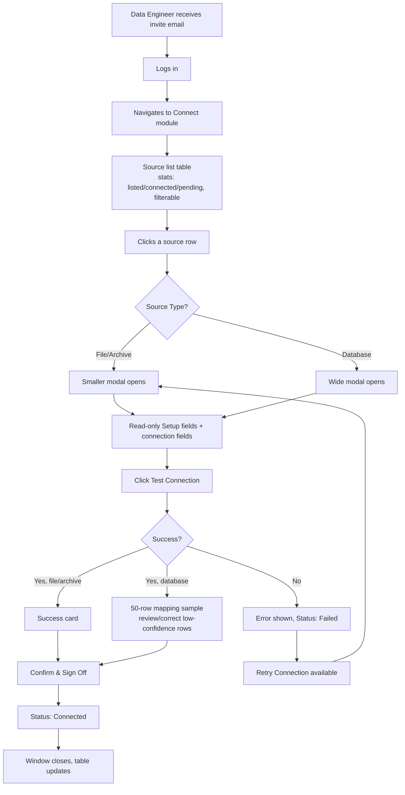

# Connect Module — User Journeys

## Module Objective
Connect is where an organization's estate becomes real to Akki. Used by the DPO (governance and source declaration) and the Data Engineer (technical connection and verification), it turns a stated intent — "we have these data sources, under these rules" — into a governed, verified starting state: rules locked, sources declared, and each source technically connected and confirmed. Nothing else in Akki can begin until this module completes.

## Users Involved
- **DPO** — accountable signer of the organization's governance configuration. Can complete Setup, edit it before sign-off, and is the only role authorized to sign off and lock.
- **Data Engineer** — connects each declared source: connection details, testing, mapping resolution, sign-off per source. Cannot declare new sources or set usage rights.
- **Governance Sponsor** and **Governance Co-Signer** — named at Setup as contacts, not active in Connect itself; used later exclusively within the Govern module.

---

# Journey 1 — Org Setup

**Role:** DPO or authorized user (Data Engineer) fills; DPO signs off
**Frequency:** Once, at onboarding (source-addition variant recurs via Add Source)

## Goal
Establish the organization's governed starting state — identity, regulatory context, deployment intent, governance rules, and declared sources — locked under DPO authority, with the resulting users automatically populating Team's Manage Users table.

## Flowchart

## Steps

**Step 1 — Organization Details**
- Organization Name (text, mandatory)
- Primary Regulator (free text, mandatory)
- Where Akki Will Run (dropdown, mandatory): On-Premise / Cloud Account — no deferred option; user is expected to confirm with IT informally before selecting

All fields mandatory; user can navigate freely between steps regardless of completion (only final Sign Off is gated).

**Step 2 — Contacts**
- DPO Name & Contact (mandatory). Note beneath: *"[DPO Name] will be asked to countersign rule changes, approve deletions, and sign the go-live record."*
- Data Engineer Name (mandatory)
- Data Engineer Email (mandatory)
- **Governance Sponsor** Name & Contact (mandatory) — a senior/executive identity, distinct from DPO and Data Engineer. Used later only within Govern's Governance Setup, as the top-tier approver for changing who holds Governance Co-Signer or Governance Sponsor authority. Established once, here, outside any governance machinery that could later self-modify it.
- **Governance Co-Signer** Name & Contact (mandatory) — the day-to-day second approver for deletion requests and rule-change counter-signatures within Govern.

**Step 3 — Governance Rules**
All six rules shown as a list, each row: one-sentence plain-text description (no bold label), a control matched to rule type —
- Boolean rules → toggle, recommended default shown as grey helper text
- Numeric rules (e.g. rule-tightening wait, quarantine threshold) → number input with unit, recommended value as helper text

Persistent note: *"These choices are permanently recorded. Changing them later requires two approvals."*

**Step 4 — Data Sources**
Per declared source:
- Source Name / Label
- Source Type (archive mount / file store / database)
- Usage Rights (dropdown, single-select, mandatory): Internal Only / Internal + Partner Sharing / Licensable-Commercial Use / Regulatory-Compliance Use Only

At least one source required.

**Step 5 — Review**
Read-only summary grouped by step, back button per section. Step indicator at top shows Complete/Incomplete per step; navigation free in any order. DPO may edit any field at this stage — no ceremony required, since nothing is locked yet. If filled by Data Engineer, submission notifies DPO (notification center + email).

**Sign Off and Lock**
Button disabled until every step shows Complete. Only the DPO, authenticated in their own session, can trigger this. On confirmation:
- Toast: *"Configuration locked."*
- Progress bar with percentage, 5 stages: Registering organization → Locking governance rules → Recording data sources → Generating Data Engineer invite → Preparing workspace

**Post-Signoff Screen (persistent DPO home)**
- Status banner ("Configuration locked. Awaiting source connections.")
- Deployment target and primary regulator displayed
- Locked config summary (collapsed by default)
- Stat cards: sources declared / connected / pending — live-updating
- Source list with status chips
- Data Engineer invite status, with resend option
- **Add Source** CTA — adds a new source directly to the list as Pending; no ceremony triggered (additive change)

**Resulting Accounts:** DPO, Data Engineer, Governance Sponsor, and Governance Co-Signer now appear as **Active** rows in Team's Manage Users table — Setup is their provisioning moment; Team is where they're managed from afterward (though Governance Sponsor and Co-Signer can only be *changed*, never reassigned from scratch, through Team — see Govern's Governance Setup journey).

---

# Journey 2 — Source Connection

**Role:** Data Engineer
**Frequency:** Ongoing, per source, until all declared sources are resolved

## Goal
Convert each DPO-declared source from a stated intent into a verified, technically connected source — establishing real connectivity, and for databases, confirming the system reads the data correctly before anything counts.

## Flowchart

## Steps

**Step 1 — Access:** Data Engineer receives email invite (from Connect Setup's lock, or if added later via Team), logs in, navigates to Connect.

**Step 2 — Source List Table**
Columns: Source Name, Type, Usage Rights, Status, Date Declared. Stat summary at top (e.g. "23 listed, 4 connected, 19 pending"). Filterable by status. Data Engineer cannot add sources here.

**Step 3 — Open a Source**
Both source types now open as a **modal** (drawer retired product-wide, reserved only for the global Ask Akki drawer): a **smaller modal** for file/archive sources (lighter fields, no mapping table), a **wide modal** for database sources (mapping table needs space). Shows, read-only: Source Name, Source Type, Usage Rights (from Setup). Below: Data Engineer provides —
- File/archive: connection link/endpoint (e.g. SFTP path, S3 URI, network share), credentials
- Database: host, port, database name, credentials (or API endpoint + key)

**Step 4 — Test Connection**
- File/archive success → simple confirmation card (e.g. "Connection successful — 1,240 files found"), no mapping step
- Database success → 50-row sample displayed with inferred column mapping (e.g. "customer_id → Customer ID"); low-confidence inferences visually flagged; Data Engineer reassigns any incorrect mapping via per-row dropdown
- Either, on failure → error and reason shown, status set to Failed, Retry Connection reopens credential fields

**Step 5 — Confirm & Sign Off**
Data Engineer confirms and signs off as the connecting person. Window closes; source list updates in place — no relocation to a separate screen.

**Step 6 — Status**
Four states: **Pending** (not yet opened), **In Progress** (opened, partially filled), **Connected** (verified, signed off), **Failed** (test failed, awaiting retry).

**Step 7 — Viewing a Resolved Source**
- Connected: read-only view — Setup info, connection details (credentials masked), timestamp, "Connected by [Data Engineer name]," and for databases, a read-only link to the confirmed mapping sample.
- Failed: same structure, plus error/reason and a Retry Connection action.
