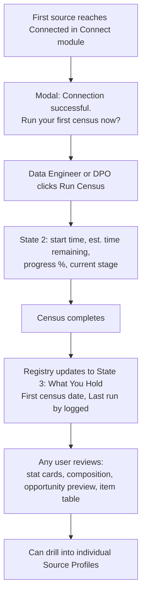
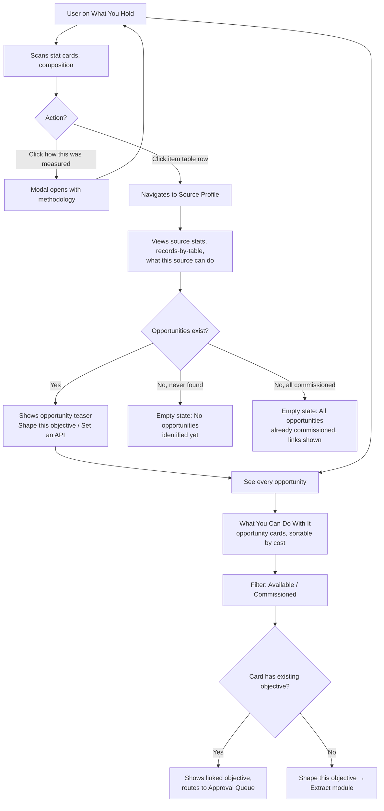
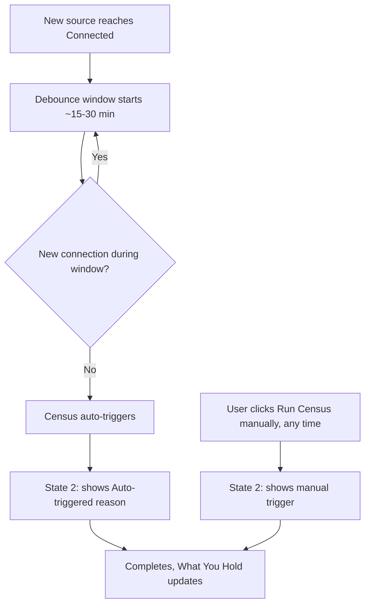

# Registry Module — User Journeys

## Module Objective
The Registry is where a connected estate becomes *known* — the measured, provable inventory of what Akki has actually found and verified, as opposed to what was merely declared at Setup. Once sources are connected, the census runs and populates the Registry: holdings per source with proof links, composition by language/era/type/quality with real counts, and gaps explicitly marked rather than hidden. It serves both the DPO/executive audience (shared "What You Hold" landing) and the ongoing exploratory needs of any user browsing what's known.

## Users Involved
- **Any authenticated user** — shared landing page, all roles see the same "What You Hold" view.
- **Data Engineer / DPO** — can trigger census runs (auto or manual).

---

# Journey 1 — First Census & Estate Review

**Role:** Data Engineer / DPO (trigger), any role (review — shared landing)

## Goal
Get the estate measured for the first time so the organization can see, with evidence, what it actually holds.

## Flowchart

## Steps

**Step 1 — Trigger:** First source reaches Connected status → modal: "Connection successful. Run your first census now?" → Data Engineer or DPO clicks Run Census.

**Step 2 — Census Running (State 2):** Start time, estimated time remaining, progress bar %, current stage label (e.g. "Reading...").

**Step 3 — Completion:** Census completes. Registry updates to State 3 ("What You Hold"), stamped "First census · [date]," "Last run by [name]" logged.

**Step 4 — Review (What You Hold landing):**
- **8 stat cards:** Total volume held, Sources connected, Data types present, Languages observed, Share already verified, Share carrying PII, Licensed for external use, Not yet measured — each with a "how this was measured" link (opens a modal/popover with methodology, not a drawer or page)
- **Composition panel** — bar breakdown by relevant dimension (e.g. language), hatched pattern for "not yet measured"
- **"What this estate can do" preview panel** — 1–2 opportunity teasers, "See every opportunity →" link
- **Item-by-item table** — columns: **Source, Data Type, Size/Volume, Languages, Rights, Condition, Last Measured, Extracted %**. Row click → Source Profile.

No approval action exists for census — review is descriptive only.

---

# Journey 2 — Exploring the Estate & Opportunities

**Role:** Any authenticated user
**Scope:** What You Hold → Source Profile → What You Can Do With It

## Goal
Let a user browse what the census found, verify any number's methodology, and move between estate-level and source-level detail, or out to opportunities — freely, in any order.

## Flowchart

## Steps

**Step 1 — Browse What You Hold:** Stat cards, composition breakdown, item-by-item table — hub for this journey.

**Step 2 — Check Methodology:** Any "how this was measured" link opens a modal explaining that metric, closes back to the same view.

**Step 3 — Drill into a Source (Source Profile inner page):**
- **6 stat-style fields:** Records, Fields Mapped, PII Fields Flagged, Quality, Rights, Extracted % — each with its own "how this was measured" link
- **Records by table** — breakdown bars
- **"What this source can do"** panel
- **Contents table** — Table, Records, Fields Mapped, PII Flagged, Quality, Last Census, Rule Coverage, Used by Objectives

**Step 4 — Source-Level Opportunities:** If opportunities exist, shown with CTAs — **"Shape this objective"** (all Usage Rights permit extraction; system decides file vs. integration delivery method — routes to Extract) or **"Set an API against this"** (routes to Extract's Integrate screen). Two distinct empty states if none: "No opportunities identified yet" (never found) vs. "All opportunities already commissioned" (with links to existing objectives).

**Step 5 — Full Opportunities View (What You Can Do With It):** Reached via "See every opportunity" from either surface. Sortable by cost, shows total opportunity count + count already commissioned, filterable **Available / Commissioned**.

**Step 6 — Act on an Opportunity:** Cards without an existing objective show "Shape this objective" (→ Extract's Shape an Objective, prefilled). Cards already tied to an objective show that objective's reference instead, routing to Approval Queue — prevents duplicate objectives for the same opportunity.

---

# Journey 3 — Re-Running the Census

**Role:** System (auto), or Data Engineer / DPO (manual)

## Goal
Keep the estate's measured record current as new sources connect, automatically, while still allowing an on-demand refresh.

## Flowchart

## Steps

**Auto path:** New source(s) connect → debounce window (~15–30 min, resets on further connections) → census auto-triggers → State 2 shows "Auto-triggered: [N] new sources connected" → completes, updates What You Hold, logs trigger.

**Manual path:** Data Engineer or DPO clicks Run Census any time → same State 2 display, logs manual trigger and who initiated it → same completion and update.

Both paths log to the same audit trail (who/what triggered, when) and converge on identical State 3 results.

---

# Journey 4 — Ask Akki (Registry Context)

Covered by the standalone, cross-cutting **Ask Akki Drawer** journey (see Shared Components document). No Registry-specific variant is needed — the drawer's suggested questions adapt automatically to whichever Registry screen the user is on.
