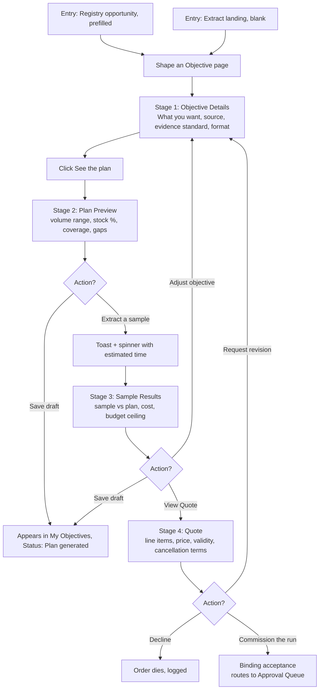
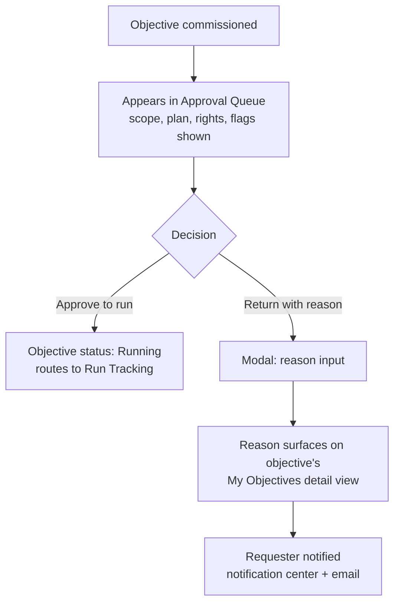
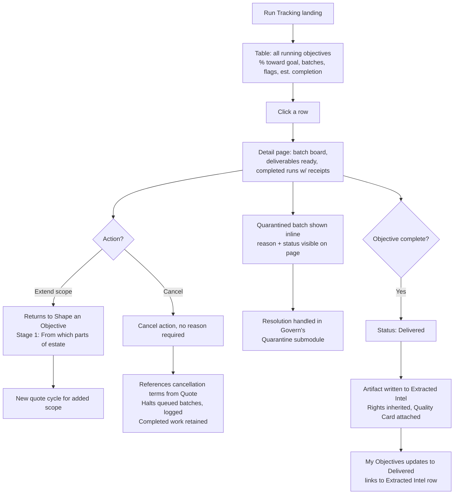
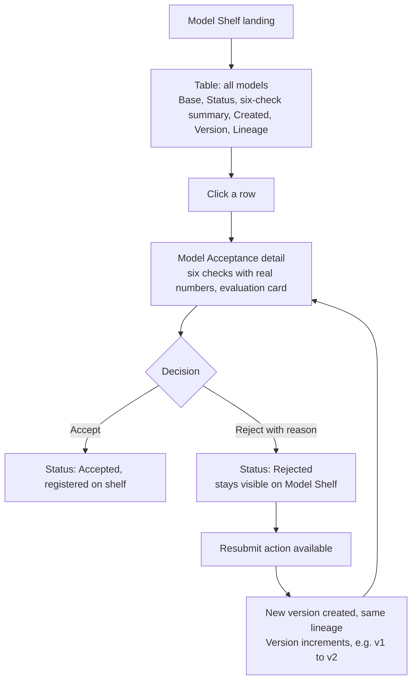
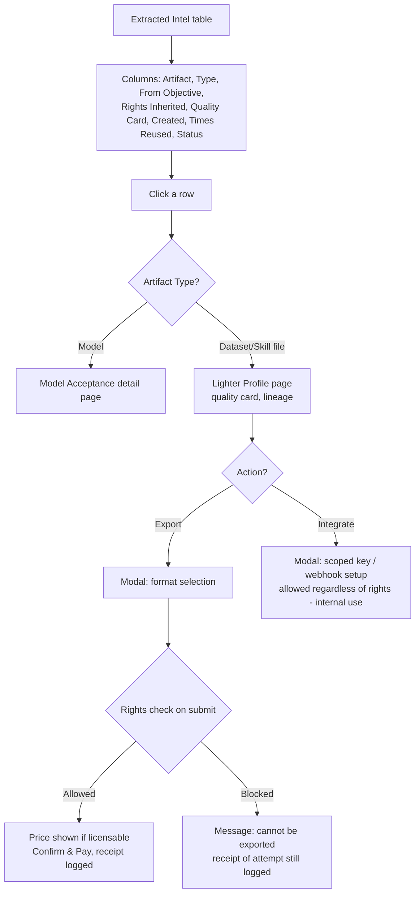

# Extract Module — User Journeys

## Module Objective
Extract is where opportunities become governed, priced, executed work — and where resulting artifacts (datasets, skill files, models) are managed, exported, or integrated. It covers the full path from shaping a need into a quoted objective, through approval and execution, to the artifacts landing in Extracted Intel.

## Users Involved
- **Analyst** (or any user acting as requester) — shapes objectives, tracks runs, browses artifacts.
- **Run/Commission Approver** — approves commissioned objectives before they run (role name provisional).
- **Model Acceptor** — reviews and accepts/rejects trained models (role name provisional).

## Cross-Module Handoffs
- **In:** Registry's opportunity cards → prefill Shape an Objective.
- **Out:** Completed objectives → write artifacts to Extracted Intel automatically.
- **Out:** Quarantined batches → visible inline here, resolved in Govern's Quarantine submodule.
- **Out:** Rejected models → resubmission creates a new linked version.

---

# Journey 1 — Shape an Objective

**Role:** Analyst

## Goal
Turn a need — from Registry's opportunities or a blank start — into a priced, scoped, quoted objective ready for commissioning, with full visibility into cost and coverage before anything is committed.

## Flowchart

## Steps

**Step 1 — Entry:** From Registry's "Shape this objective" (prefilled: want/source/est. cost) or Extract's own "Shape an Objective" button on the My Objectives landing page (blank).

**Step 2 — Stage 1, Objective Details** (single full page, progressive disclosure — not paginated steps, not a modal):
- What you want (free text)
- From which parts of the estate
- To what standard of evidence: "Every fact verified against source" / "Sampled 1%"
- Delivered as: Dataset / Skill file / JSON / Model

CTA: **See the plan**

**Step 3 — Stage 2, Plan Preview:** Appears below Stage 1 (which remains editable — plan re-generates if fields change). Shows: extraction volume as a range, % reusable from stock, expected goal coverage, what cannot be covered. CTA: **Extract a sample** or **Save draft**.

**Step 4 — Sample Extraction:** Toast notification + spinner with estimated time (lightweight loading state, not a full staged progress bar).

**Step 5 — Stage 3, Sample Results** (Cost & Commit content merged here): sample-vs-plan comparison table (facts per document, verification pass rate, relevance of index picks, cost per 1,000 items — planned vs. observed), editable budget ceiling with note "the run halts at the ceiling, nothing past it is billed." CTA: **View Quote** / **Adjust objective** (returns to Stage 1) / **Save draft**.

**Step 6 — Stage 4, Quote:** Line items, total price, validity countdown, delivery estimate, cancellation terms. CTA: **Commission the run** (binding acceptance) / **Decline** / **Request revision** (returns to Stage 1).

**Step 7 — Commission:** On acceptance, objective becomes the order of record, routes to **Approval Queue**. The draft table entry becomes a **dimmed, read-only row linking to Run Tracking** rather than disappearing.

**Draft Handling:** Save at any stage → appears in My Objectives with status reflecting stage reached (Details only / Plan generated / Sample run / Quote pending). **Discard** deletes immediately, no confirmation required.

**My Objectives Table (Extract's landing page)** — columns: **Objective, Source, Stage/Status, Est. Cost, Last Edited, Owner, Action** (Resume/Discard). Full status range across its lifetime: Draft → Plan generated → Sample run → Quote pending → Awaiting approval → Running → Delivered.

**Objective Detail View (non-draft statuses)** — clicking a non-Draft row opens an inner page (not a drawer, to avoid conflicting with the global Ask Akki drawer) with content conditional on status:
- Quote pending: full interactive content (line items, actions) — no other screen owns this state
- Awaiting approval: status only, no action available to this user
- Running: mini progress snapshot + "View full run tracking →"
- Delivered: artifact list + "View in Extracted Intel →"

---

# Journey 2 — Approval Queue

**Role:** Run/Commission Approver

## Goal
Give a human gate before commissioned work actually runs and spends resources.

## Flowchart

## Steps

**Step 1 — Queue:** Commissioned objectives listed with Scope, Plan, Rights, and any Flags (e.g. "French excluded — below bar").

**Step 2 — Decision:** Approver clicks **Approve to run** (status → Running, appears in Run Tracking) or **Return with reason** (modal for reason input; reason surfaces on the objective's detail view in My Objectives).

**Step 3 — Notification:** Requester notified either way — notification center + email (time-blocking event).

---

# Journey 3 — Run Tracking

**Role:** Whoever commissioned the objective (Analyst)

## Goal
Let the requester see honest, real-time progress on a running objective, including problems, and act on it (extend scope, cancel) without needing to ask anyone.

## Flowchart

## Steps

**Step 1 — Landing:** Table of all running objectives — **Objective, % toward goal, Batches (done/total), Flags, Commissioned date, Est. completion**.

**Step 2 — Detail Page:** Batch board (done/running/quarantined/queued tiles), % toward goal with basis (e.g. "based on 15,240 of 22,400 target facts"), completed runs with receipt links, deliverables-ready panel with downloads.

**Step 3 — Quarantine Visibility:** Quarantined batches show their reason and status **inline on this page** — never hidden. Resolution action itself lives in Govern's Quarantine submodule, linked from here.

**Step 4 — Extend Scope:** Returns to Shape an Objective's "From which parts of the estate" field. **Always generates a new quote/pricing cycle** for the additional scope — never silently folds into the existing run.

**Step 5 — Cancel:** Available from this detail page. **No reason required.** References the cancellation terms already agreed at Quote stage. Halts future queued batches; completed extraction work is retained (nothing deleted). Logged.

**Step 6 — Completion (handoff to Extracted Intel):** When the objective reaches its defined completion point, status updates to **Delivered**. Resulting artifact(s) automatically written to **Extracted Intel** (Artifact, Type, From Objective ID, Rights Inherited, Quality Card, Created date, Times Reused = 0, Status = Live). My Objectives entry also updates to Delivered, linking to the new Extracted Intel row(s).

---

# Journey 4 — Model Acceptance

**Role:** Model Acceptor

## Goal
Formally register a trained model once its six automated checks confirm it's safe and effective to use, with a path to resubmit if rejected.

## Flowchart

## Steps

**Step 1 — Landing (Model Shelf):** Table — **Model name, Base, Status (Pending Review / Accepted / Rejected), Six-check summary (e.g. "5/6"), Created, Version, Lineage** (parent model reference for resubmitted versions).

**Step 2 — Detail:** Model Acceptance page — the six automated checks (beats base, damages nothing else, full lineage, evaluation card, calibrated confidence, held-out evaluation), each with real measured numbers, plus the evaluation card panel (WER by category, test set size, lineage source).

**Step 3 — Decision:** **Accept** (registers the model, Status: Accepted) or **Reject with reason** (Status: Rejected, reason logged — model **stays visible permanently** on the Model Shelf table, consistent with the product's general practice of surfacing failures rather than hiding them).

**Step 4 — Resubmission:** A Rejected model's detail page includes a **Resubmit** action. Resubmitting creates a new version of the same lineage (Version increments, e.g. v1 → v2), re-runs the six checks, and the new version appears as its own row linked to the same lineage. The rejected version remains visible for audit purposes.

---

# Journey 5 — Extracted Intel

**Role:** Any authenticated user (viewing), Analyst typically (acting)

## Goal
Let users browse produced artifacts and either export them out of the org or integrate them into internal systems, with rights checked at the point of action rather than hidden upfront.

## Flowchart

## Steps

**Step 1 — Landing:** Single merged table for Datasets, Skill files, and Models — **Artifact, Type, From Objective, Rights Inherited, Quality Card, Created, Times Reused, Status**.

**Step 2 — Row Click:** Model rows → Model Acceptance detail page. Dataset/Skill file rows → **Profile page** (lighter than Model's): Records/Size, Fields Mapped, Quality %, Rights Inherited, Times Reused, Created Date; Lineage panel (From Objective link, extraction method, evidence standard); Quality card (measured numbers).

**Step 3 — Export:** Available regardless of stated rights. Opens a modal for **format selection**; **rights check happens on submit, inside the modal** — if allowed, price shown (if licensable) with Confirm & Pay, receipt logged; if blocked, message shown ("this artifact is internal-only and cannot be exported"), receipt of the attempt still logged.

**Step 4 — Integrate:** Available regardless of rights (Internal Only permits integration — distinct from export). Modal fields:
- **Scoped key** — auto-generated, read-only, tags: artifact name, access level (e.g. "read-only"), "masking enforced," "logged"
- **Webhook URL** — user-entered endpoint
- **Event type** — dropdown (e.g. artifact.updated, delivery.completed)
- **Status** — Active/Inactive toggle
- Note: "Every call appears in the same record the DPO watches"

**Step 5 — Audit Trail:** Every Export/Integrate action (successful or blocked) feeds the same DPO-visible log referenced in the Integrate screen ("What the DPO sees" panel).

---

# Journey 6 — Ask Akki (Extract Context)

Covered by the standalone, cross-cutting **Ask Akki Drawer** journey (see Shared Components document). No Extract-specific variant needed.
