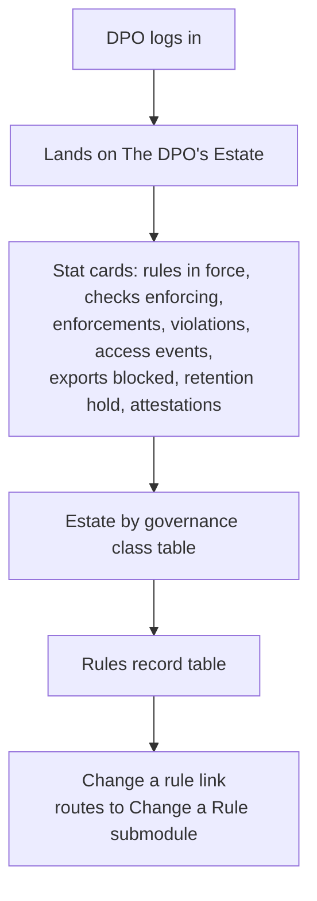
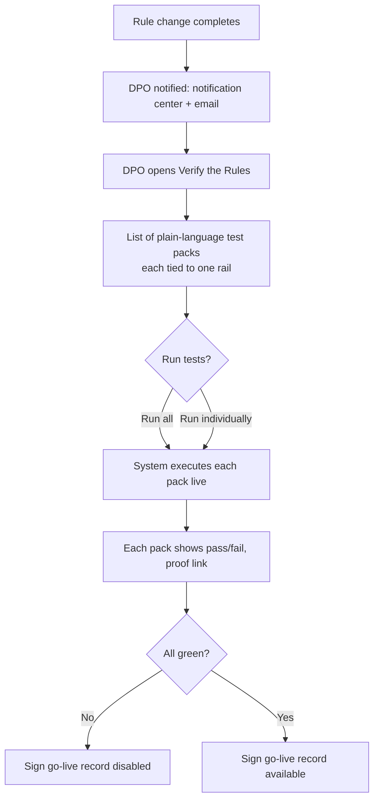
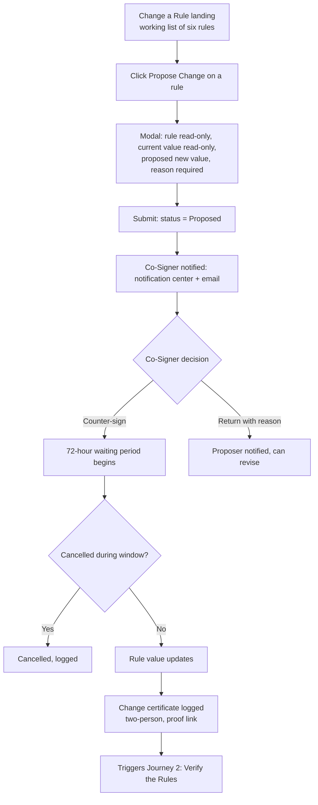
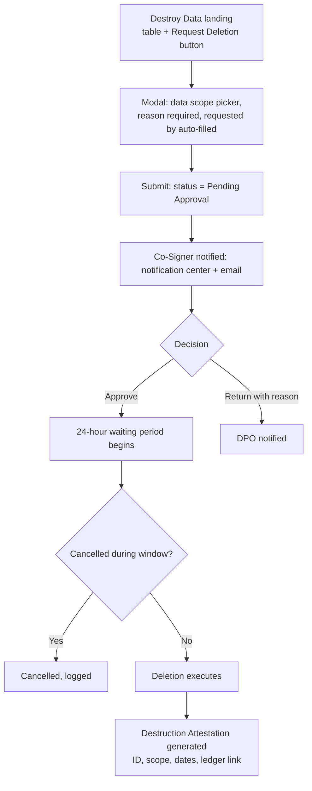
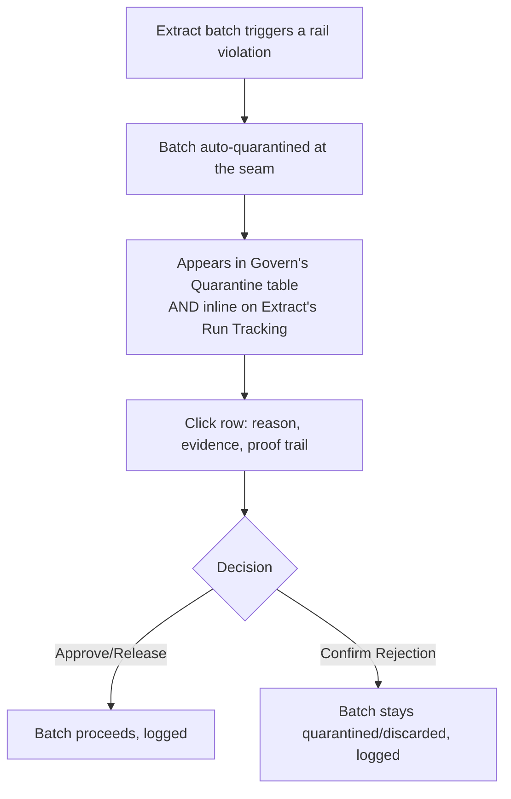
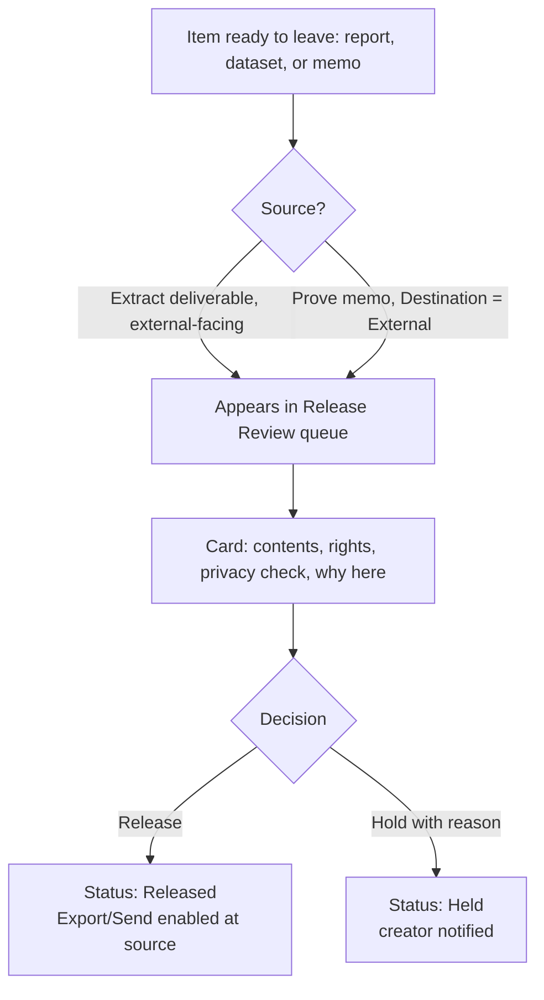
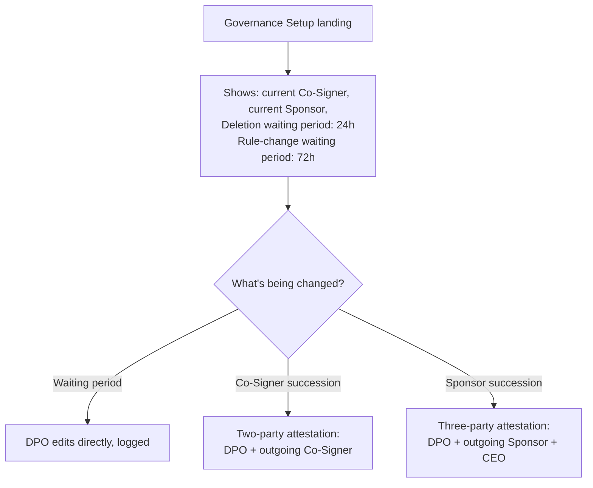

# Govern Module — User Journeys

## Module Objective
Govern is the DPO's home — proof that configured governance rules are actually enforced, plus the mechanisms (deletion, rule changes, release, quarantine, succession) that require human authority and dual/triple control. The DPO's Estate serves as the landing page; all other submodules are reached via a Govern-specific side navigation.

## Users Involved
- **DPO** — reviews the Estate, proposes rule changes, requests deletions, decides Release Review items, initiates Governance Setup changes.
- **Governance Co-Signer** — counter-signs rule changes and deletion requests. Named once at Connect's Setup; can only be *changed* afterward (two-party succession: DPO + outgoing Co-Signer), never freely reassigned.
- **Governance Sponsor** — top-tier approver for changes to Governance Setup itself (who holds Co-Signer/Sponsor authority). Named once at Connect's Setup; succession requires three-party attestation (DPO + outgoing Sponsor + CEO).

## Cross-Module Handoffs
- **In:** Extract's quarantined batches → Govern's Quarantine submodule.
- **In:** Extract's external-facing deliverables and Prove's external memos → Govern's Release Review.
- **Out:** Rule-change completion → triggers Verify the Rules.
- **Out:** Governance Setup changes → Higher-tier approvals live outside the standard Co-Signer chain.

---

# Journey 1 — The DPO's Estate

**Role:** DPO

## Goal
Give the DPO a single, provable, read-only view of governance in force — rules, enforcement stats, violations — distinct from where changes are actually made.

## Flowchart

## Steps

**Step 1 — Landing:** DPO's default landing for Govern.

**Step 2 — Stat Cards (8):** Rules in force, Checks enforcing them, Enforcements this month, Violations, Access events (30d), Exports blocked, Under retention hold, Destruction attestations. Each has a **"see the record"** link opening a detail view specific to that stat:
- Access events → log table: Timestamp, User, Action, Resource, Receipt ID
- Exports blocked → log table: Timestamp, Artifact, Requested By, Reason Blocked, Receipt ID
- Under retention hold → table: Record set, Volume, Rule Applied, Hold Until Date
- Destruction attestations → table: Attestation ID, Scope, Date Issued (links to Destroy Data detail)
- Rules in force / Checks enforcing / Enforcements / Violations → route into the Rules Record table below, filtered to context

**Step 3 — Estate by Governance Class table:** Data Class, Volume, Where Held, Rule Applied, Enforcements (30d), Violations, Status.

**Step 4 — Rules Record table:** Rule, Current Setting, Set By/When, Checks, Enforcements (30d), Violations, Last Change (certificate + proof link).

**Step 5 — Exit point:** "Change a rule →" is the only inline action from this page. All other submodules reached via Govern's side nav. This page stays strictly read-only — no authoring happens here.

---

# Journey 2 — Verify the Rules

**Role:** DPO

## Goal
Prove, with live evidence, that governance rails actually fire as configured — triggered specifically when a rule changes.

## Flowchart

## Steps

**Step 1 — Trigger:** Fires when a governance rule change completes (not on census). DPO notified via notification center + email.

**Step 2 — Landing:** List of test packs, each testing one rail in plain language (e.g. "Personal data is masked before any AI call"), each showing pass/fail and rail count (e.g. "14/14 rails pass"), with a **"proof"** link.

**Step 3 — Proof Detail:** Opens a view showing the specific rail tested, the live check's raw result (e.g., which record was probed, expected vs. observed), timestamp of the run, and a link to the underlying ledger entry.

**Step 4 — Execution:** "Run all tests" or individually. System exercises each scenario live against the running instance.

**Step 5 — Completion:** Once every pack shows green, **"Sign go-live record"** becomes available.

---

# Journey 3 — Change a Rule

**Role:** DPO (proposes), Governance Co-Signer (counter-signs)

## Goal
Let a governance rule change move through a visible, reversible pipeline — never edited in place — before it takes effect.

## Flowchart

## Steps

**Step 1 — Landing (working list):** Table — **Rule, Current Value, Status (No proposal in flight / Proposed / Counter-signed / Waiting period / Applied), Last Changed, Propose Change** (action). Only one active proposal per rule at a time; an in-flight proposal's row shows live status and links to the pipeline detail view.

**Step 2 — Propose:** Modal — rule (read-only), current value (read-only), proposed new value, reason (required).

**Step 3 — Counter-sign:** Routes to Governance Co-Signer (notification center + email). Approves (72-hour waiting period begins) or Returns with reason (proposer notified).

**Step 4 — Waiting Period:** Pipeline detail view shows **Proposed → Counter-signed → Waiting period → Applied**, each stage with who/when. DPO can **cancel before it applies**, logged, no reason required.

**Step 5 — Applied:** Rule value updates, change certificate logged (two-person, proof link) — reflected in Estate's "Last Change" column.

**Step 6 — Handoff:** Completion **triggers Journey 2 (Verify the Rules)**.

---

# Journey 4 — Destroy Data

**Role:** DPO (requests), Governance Co-Signer (approves)

## Goal
Let the DPO request deletion of specific data under dual control and a waiting period, ending in a destruction attestation.

## Flowchart

## Steps

**Step 1 — Landing:** Table — **Request ID, Data Scope, Status, Requested By, Approved By, Time Remaining/Completed Date, Certificate** — plus **Request Deletion** button.

**Step 2 — Request:** Modal — Data scope (picker from Registry's known sources), Reason (required), Requested by (auto-filled, DPO).

**Step 3 — Approval:** Routes to Governance Co-Signer (notification center + email). Approve → 24-hour waiting period begins. Return with reason → DPO notified.

**Step 4 — Waiting Period:** DPO can cancel, logged, no reason required. Executes automatically at window close otherwise.

**Step 5 — Completion:** Destruction Attestation generated — ID, scope, requested/approved by, dates, method confirmation, ledger link. Attached to the request's detail view.

---

# Journey 5 — Quarantine

**Role:** DPO (or delegated reviewer, single-person review)

## Goal
Give a single-person review point for anything the rails have automatically quarantined, org-wide — not hidden, always visible with a resolution path.

## Flowchart

## Steps

**Step 1 — Trigger (handoff from Extract):** A rail violation (e.g., masking recall below threshold) auto-quarantines a batch at the seam. Shown inline on Extract's Run Tracking, linking here for resolution.

**Step 2 — Landing:** Table — **Batch/Item ID, Source Objective** (links to Run Tracking), **Reason Quarantined, Date, Status (Under Review/Resolved), Resolved By/Note**.

**Step 3 — Review:** Click a row for full context — the specific rail that fired, evidence, proof trail.

**Step 4 — Resolution:** Single-person decision — **Approve/Release** (batch proceeds) or **Confirm Rejection** (stays quarantined/discarded per retention rules). Logged; Extract's Run Tracking reflects the resolved status.

---

# Journey 6 — Release Review

**Role:** DPO

## Goal
Give a final human gate before anything — reports, datasets, or memos — actually leaves the organization's perimeter.

## Flowchart

## Steps

**Step 1 — Trigger (explicit handoffs):**
- From **Extract**: deliverables whose rules require review (e.g. licensed/external items) land here automatically.
- From **Prove**: memos with Destination = External land here automatically upon save.

**Step 2 — Landing:** Queue — each card shows **Contents, Rights, Privacy check** (e.g. "all groups ≥ 20 ✓"), **Why here** (e.g. "Outbound to Risk Committee").

**Step 3 — Decision:** **Release** (item becomes usable/exportable at its source, creator notified) or **Hold with reason** (item stays blocked, reason visible to creator, notified).

**Step 4 — Notification:** Creator notified either way — notification center + email.

---

# Journey 7 — Governance Setup

**Role:** DPO (day-to-day settings), with escalated succession controls for the Co-Signer and Sponsor roles

## Goal
Let the DPO configure waiting periods and view current governance role holders, while changes to *who holds* Co-Signer or Governance Sponsor authority are gated by strict, evidence-based succession controls established outside the system's own machinery.

## Flowchart

## Steps — Waiting Periods

**Step 1 — Landing:** Shows current Deletion waiting period (24h) and Rule-change waiting period (72h) as independently editable fields, plus current Governance Co-Signer and Governance Sponsor names (read display, with a **change history** detail view: prior holders, dates changed, attestation references on file).

**Step 2 — Edit:** DPO edits a waiting period value directly; change logged.

## Steps — Governance Co-Signer Succession (Two-Party)

**Step 1 — Initiate:** DPO initiates a change request: new Co-Signer's name/contact, reason.

**Step 2 — Attestation:** Requires **two uploaded, signed physical document references** — one from the DPO, one from the outgoing Co-Signer. Both must be on file before proceeding.

**Step 3 — Waiting Period:** Once both attestations are uploaded, a waiting period begins (recommended: matching the 72-hour rule-change window at minimum). DPO can cancel during the window, logged.

**Step 4 — Completion:** Co-Signer role reassigned; both attestation documents + reference IDs retained permanently in the audit record, viewable from the role's change-history detail view.

## Steps — Governance Sponsor Succession (Three-Party)

**Step 1 — Initiate:** DPO initiates a change request: new Sponsor's name/contact, reason.

**Step 2 — Attestation:** Requires **three separate uploaded, signed physical document references** — DPO, outgoing Governance Sponsor, and the organization's **CEO** (captured as an uploaded document/reference, not a live system login — CEO is not a provisioned user role). System shows a checklist state, e.g. "2 of 3 attestations received," and the request may sit in a **"Gathering attestations"** status for real-world time before completion.

**Step 3 — Waiting Period:** Once all three attestations are on file, a **7-day waiting period** begins. DPO can cancel during the window, logged, no reason required.

**Step 4 — Completion:** Sponsor role reassigned; all three attestation documents + reference IDs retained permanently, viewable from the role's change-history detail view.

**Note:** Both Co-Signer and Sponsor are named **only once**, at Connect's Setup (Journey 1). Team's Manage Users module can **change** who holds these roles (via the succession flows above) but can never freely assign them from scratch.
