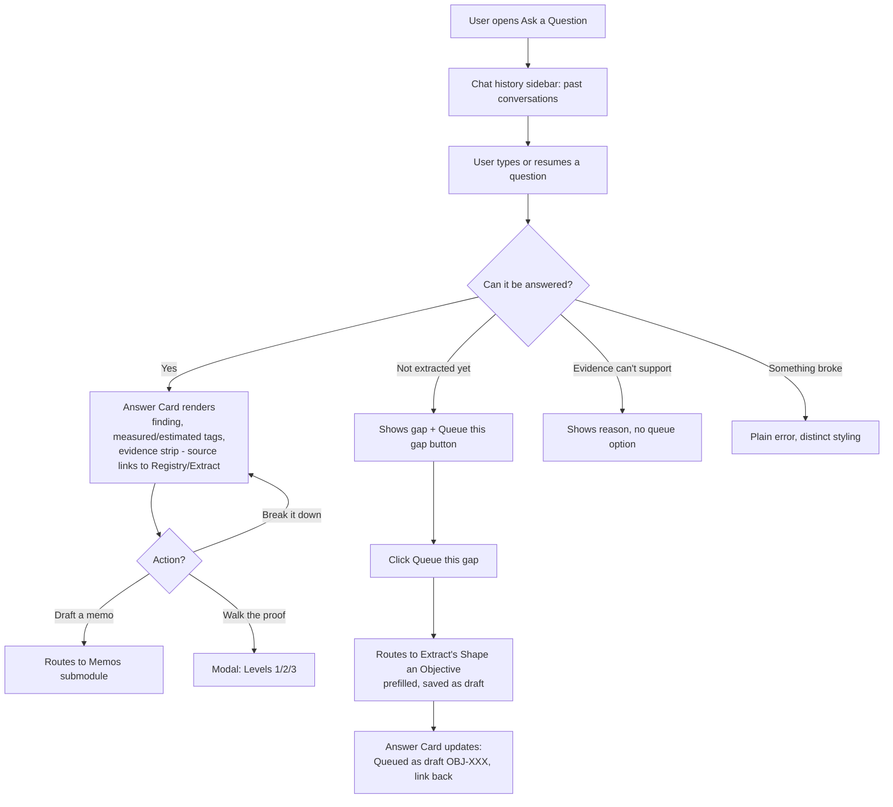
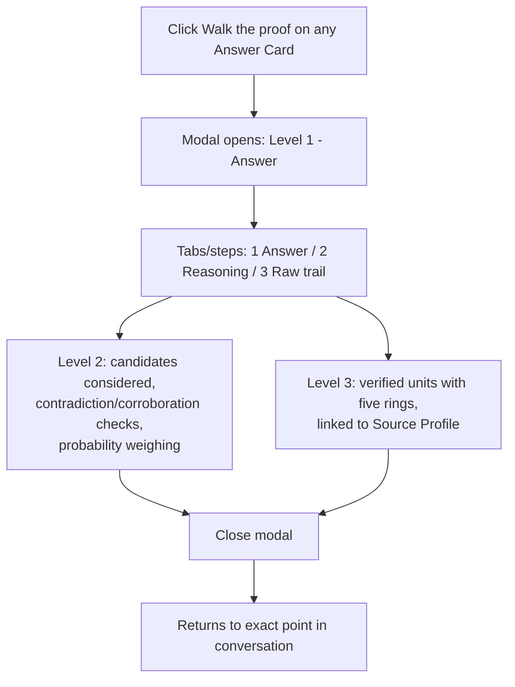
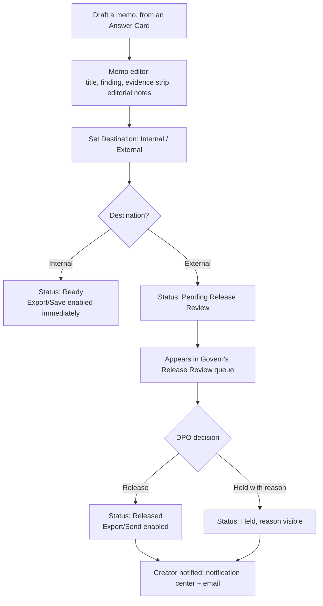
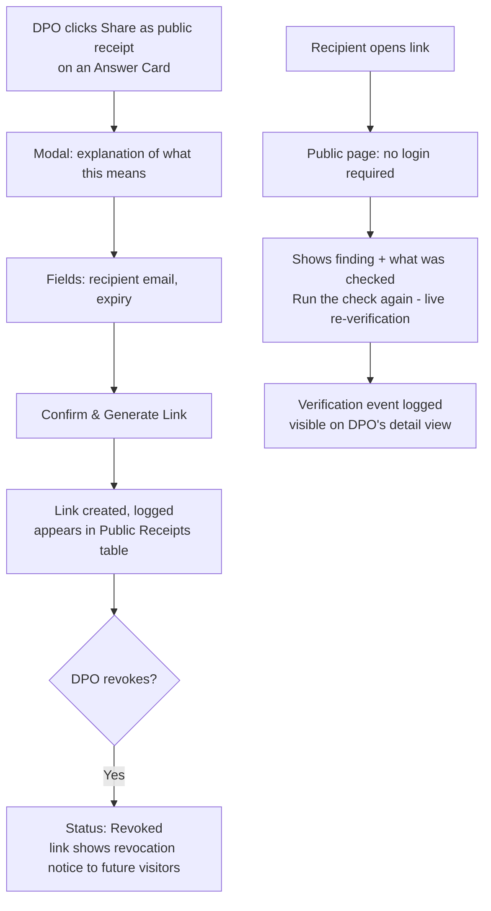

# Prove Module — User Journeys

## Module Objective
Prove is where anyone can ask a question of the estate and get a receipted, provable answer — plus the mechanisms to walk that proof, share it externally, or turn it into other work products (memos, queued extraction gaps).

## Users Involved
- **Any authenticated user** — can ask questions, walk proofs, draft memos.
- **DPO only** — can generate Public Receipts (externally shareable, no-login links) and decides external memo release (in Govern's Release Review).

## Cross-Module Handoffs
- **Out:** "Queue this gap" → Extract's Shape an Objective (prefilled draft).
- **Out:** External-destination memos → Govern's Release Review.
- **In:** Govern's Release/Hold decision → updates memo status, notifies creator.
- **Reference:** Answer Card evidence-strip source citations link back to Registry's Source Profile / Extract's objective detail.

---

# Journey 1 — Ask a Question

**Role:** Any authenticated user

## Goal
Let anyone ask the estate a question in plain language and receive a receipted, provable answer — or an honest, categorized refusal — with a path to act on either.

## Flowchart

## Steps

**Step 1 — Access:** Any user opens Ask a Question. Sidebar shows saved chat history for resuming past conversations.

**Step 2 — Ask:** User types a question or continues an existing thread.

**Step 3 — Answer Card:** Renders with finding in prose, measured/estimated tags, evidence strip (sources, slices used, privacy floor held — **source names are clickable, linking to their Registry Source Profile or originating Extract objective**), honesty strip where relevant ("what this cannot say").

**Step 4 — Refusal Shapes:** Three visually distinct states:
- **Not extracted yet** — shows the gap plainly, estimated effort to close it, "Queue this gap" button
- **Evidence can't support** — states the reason, no queue option (more extraction wouldn't help)
- **Something broke** — plain error, never disguised as the other two

**Step 5 — Queue a Gap:** Clicking routes to Extract's Shape an Objective, prefilled from the gap's description, saved as a **draft** (not commissioned). The originating Answer Card updates — "Queued as draft OBJ-XXX →" — closing the loop visibly.

**Step 6 — Further Actions:** **Break it down** (re-renders in more granular form), **Draft a memo** (routes to Memos submodule, prefilled), **Walk the proof** (opens Level 1/2/3 modal — Journey 2).

---

# Journey 2 — Walk the Proof

**Role:** Any authenticated user
**Invoked from:** any Answer Card, in Prove or via the global Ask Akki drawer

## Goal
Let a user descend from a claim to its full reasoning to its raw underlying facts, confirming the answer is genuinely traceable, not just asserted.

## Flowchart

## Steps

**Step 1 — Trigger:** Available from any Answer Card, in Prove's own Ask module or the global Ask Akki drawer.

**Step 2 — Modal Opens (Level 1, Answer):** Same content as the Answer Card, restated with the depth indicator visible (1 · Answer → 2 · Reasoning → 3 · Raw trail, shown as tabs/steps inside the modal — not separate page navigations, since each response needs its own quick-access proof without leaving the conversation).

**Step 3 — Level 2, Reasoning:** Candidates considered and why this framing won, contradiction/corroboration checks performed, probability weighing — plain language, not raw model output.

**Step 4 — Level 3, Raw Trail:** The actual verified units feeding the answer, each with its five rings (content, provenance, defensibility, context, re-extraction handle), linked back to their Source Profile in Registry.

**Step 5 — Close:** Modal closes, returns user to the exact point in their conversation — no navigation loss.

---

# Journey 3 — Memos

**Role:** Any authenticated user (create), DPO (release decision on external memos, via Govern's Release Review)

## Goal
Turn a receipted answer into a circulable document for a specific audience, gated by Release Review when it's headed outside the org.

## Flowchart

## Steps

**Step 1 — Create:** "Draft a memo" from an Answer Card opens the memo editor, pre-populated from that answer. Fields:
- Title (editable)
- Finding (pre-populated, editable)
- Evidence strip (read-only, inherited)
- Editorial notes (free text)
- Destination (Internal / External dropdown)
- Recipient/Audience (if External — free text, e.g. "Risk Committee")

CTAs: Edit / Export / Save to Memos.

**Step 2 — Destination Branch:**
- **Internal** → Status: **Ready** immediately, Export/Save available, no further gate
- **External** → Status: **Pending Release Review**, automatically appears in Govern's Release Review queue (explicit handoff) — shown as a card: contents, rights inherited, privacy check, "why here" (recipient)

**Step 3 — DPO Decision (in Govern):** Release (memo Status → **Released**, Export/Send enabled on the memo) or Hold with reason (Status → **Held**, reason visible on the memo's detail view).

**Step 4 — Notification:** Creator notified either way — notification center + email.

**Step 5 — Memos Landing/Table:** Columns — **Title, Related Answer, Destination, Status, Created, Created By**. Row click opens the memo's detail/editor view.

---

# Journey 4 — Public Receipts

**Role:** DPO only

## Goal
Let the DPO generate a no-login, externally verifiable link to a specific answer, for sharing with auditors, regulators, or courts — with expiry and revocation under the DPO's control.

## Flowchart

## Steps

**Step 1 — Generate:** DPO clicks "Share as public receipt" from an Answer Card. Modal explains what sharing means plainly, requires:
- Recipient email (required)
- Expiry (date/duration)

CTA: **Confirm & Generate Link**.

**Step 2 — Logged:** Link creation logged (who shared, when, to whom, expiry), appears as a new row in the **Public Receipts** table — columns: **Answer Reference, Shared With, Shared By, Date Shared, Expires, Status (Active/Expired/Revoked), Action (Revoke)**.

**Step 3 — Recipient Experience:** Anyone holding the link opens it with **no account, no login**. Sees: the finding, "what was checked in plain words" (verbatim number check, source-timestamp integrity, group-size privacy floor, chain integrity), and a **"Run the check again"** button that re-verifies live in-browser against the sealed record.

**Step 4 — Verification Tracking:** Each verification event (including recipient re-checks) is logged, visible on the receipt's detail view — e.g. "Verified 14 times, last on [date]."

**Step 5 — Revocation:** DPO can revoke any active link from the table. Once revoked, future visitors see a plain notice: "This receipt has been revoked and is no longer available" — never a silent error.
