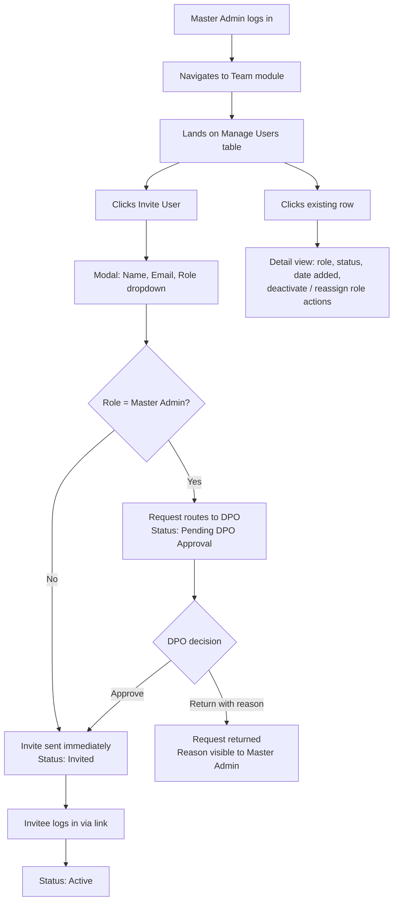

# Team Module — User Journey

## Module Objective
Team is the standing, ongoing home for provisioning and managing everyone who has access to the org's Akki instance — Analysts, Data Engineers, additional DPOs, and Master Admins — independent of Connect's one-time Setup flow. It also serves as the *change* (never initial assignment) point for the two most sensitive roles, Governance Co-Signer and Governance Sponsor, whose succession is handled with escalated controls documented in the Govern module.

## Users Involved
- **Master Admin** — owns this module; invites and manages all standard users.
- **DPO** — required party in Governance Co-Signer/Sponsor succession flows (documented in Govern, not here).

---

# Journey 1 — Manage Users

**Role:** Master Admin

## Goal
Let the Master Admin invite, view, and manage everyone with access to the org's Akki instance from one standing screen, with Master Admin-level promotions routed through the DPO for approval.

## Flowchart

## Steps

**Step 1 — Access:** Master Admin logs in, navigates to the Team module.

**Step 2 — Landing (Manage Users table):** Table showing every user with access to this Akki instance. Columns: **Name, Email, Role, Status (Invited / Active / Deactivated / Pending DPO Approval), Date Added**. Primary CTA: **Invite User**.

**Step 3 — Invite User:** Modal fields:
- Name
- Email
- Role (dropdown: Analyst / Data Engineer / DPO / Master Admin)

On submit:
- **Analyst / Data Engineer / DPO** → invite sent immediately, Status = Invited
- **Master Admin** → request routes to the **DPO** for approval (notification center + email); Status = **Pending DPO Approval**. DPO can **Approve** (invite proceeds) or **Return with reason** (visible to Master Admin on that row, can revise and resubmit).

**Step 4 — Activation:** Invitee opens the emailed link, logs in, account activates. Table row updates to Status = **Active**.

**Step 5 — Managing an Existing User:** Clicking any row opens a detail view — role, status, date added, with actions to **deactivate** or **reassign role** (a straightforward Master Admin action for standard roles, not gated).

**Note — Governance Roles Excluded:** **Governance Co-Signer** and **Governance Sponsor** are named once, only at Connect's Setup, and never appear as freely assignable options in this Invite modal. Team's role in changing *who* holds either of these two roles is limited to initiating the succession flows documented in Govern's **Governance Setup** journey (two-party attestation for Co-Signer, three-party attestation for Sponsor) — this module does not perform that reassignment directly.

**Handoff:** DPO, Data Engineer, and Governance Sponsor/Co-Signer accounts created during Connect's Journey 1 (Org Setup) automatically appear in this table as **Active** upon Setup's sign-off — Team does not re-invite them, it simply becomes their ongoing management surface going forward.
