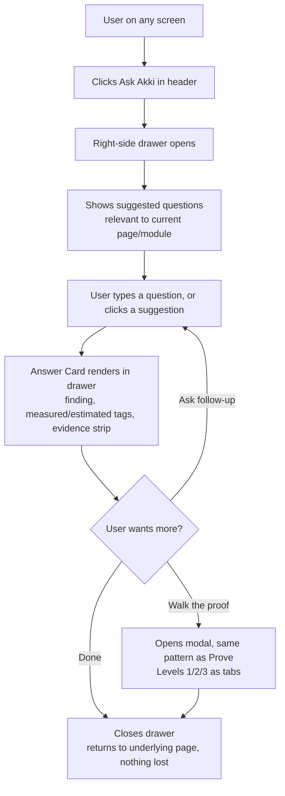

# Shared Components — Cross-Cutting Journeys

These are not owned by any single module. They appear identically across the product and are documented once here rather than repeated per module.

---

# Ask Akki Drawer

**Role:** Any authenticated user
**Scope:** Global — available from every module (Connect, Registry, Extract, Govern, Team, and alongside Prove's own full Ask module)

## Goal
Let a user ask a quick, in-context question from wherever they are in the product, without leaving the screen they're on, and get a receipted answer card in return.

## Flowchart

## Steps

**Step 1 — Trigger:** User clicks **Ask Akki**, present in the header on every screen across the product.

**Step 2 — Drawer Opens:** Right-side drawer slides in over the current page (page remains visible/dimmed behind it — not navigated away from). Shows a brief prompt ("Ask about anything on this page") and 2–3 **suggested questions** relevant to the current context (e.g. on a Source Profile, suggestions relate to that source; on My Objectives, suggestions relate to objectives).

**Step 3 — Ask:** User types a free-text question or clicks a suggested one.

**Step 4 — Answer:** Answer Card renders inside the drawer — same structure as Prove's full Ask module (finding in prose, measured/estimated tags, evidence strip, honesty strip if applicable). Same three "can't answer" shapes apply where relevant (evidence-can't-support, not-extracted-yet with Queue button, something-broke).

**Step 5 — Follow-up or Deepen:** User can ask a follow-up (drawer holds a short running conversation, same session), click **Walk the proof** (opens the same Level 1/2/3 modal used in Prove), or close the drawer — returning to the exact underlying page with no state lost.

**Note:** The drawer is a lightweight, in-context entry point. It does not replace Prove's full Ask module, which offers persistent chat history and memo/public-receipt actions the drawer does not carry. This is also the reason no other module uses a drawer pattern for its own "more detail" views — all such views use inner pages or modals instead, to avoid competing with this global drawer for the same screen real estate.

---

# Notification Center

**Role:** Any authenticated user
**Scope:** Global

## Purpose
A single, consistent mechanism for every approval request, status change, and time-sensitive event across all six modules, replacing ad hoc "the user is notified" language with one real pattern.

## Design
- **Bell icon** in the persistent header, badge count for unread items.
- Clicking opens a dropdown/panel listing notifications chronologically: what happened, which module it relates to, a direct link to the relevant screen, read/unread state.
- **Channel:** in-app by default for all notifications. **Email is also sent, non-optionally, for time-blocking/critical categories:** DPO sign-off requests (Connect), deletion and rule-change approval requests (Govern), Approval Queue items (Extract), Master Admin promotion requests (Team), Release Review items (Govern/Prove handoff).
- Routine status updates (e.g. census complete, memo saved as Ready) remain in-app only, no email.
- Every notification entry follows the same structural format regardless of source module — description, module tag, link.
